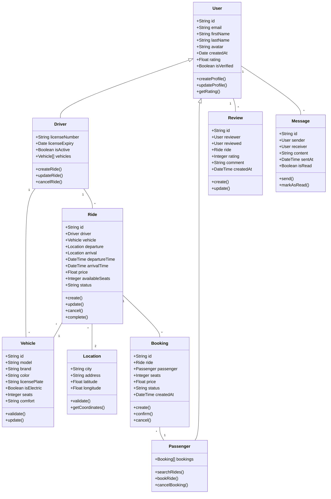
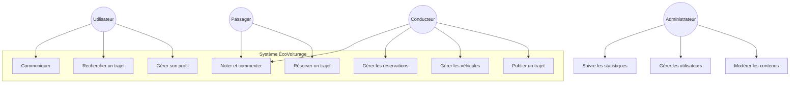
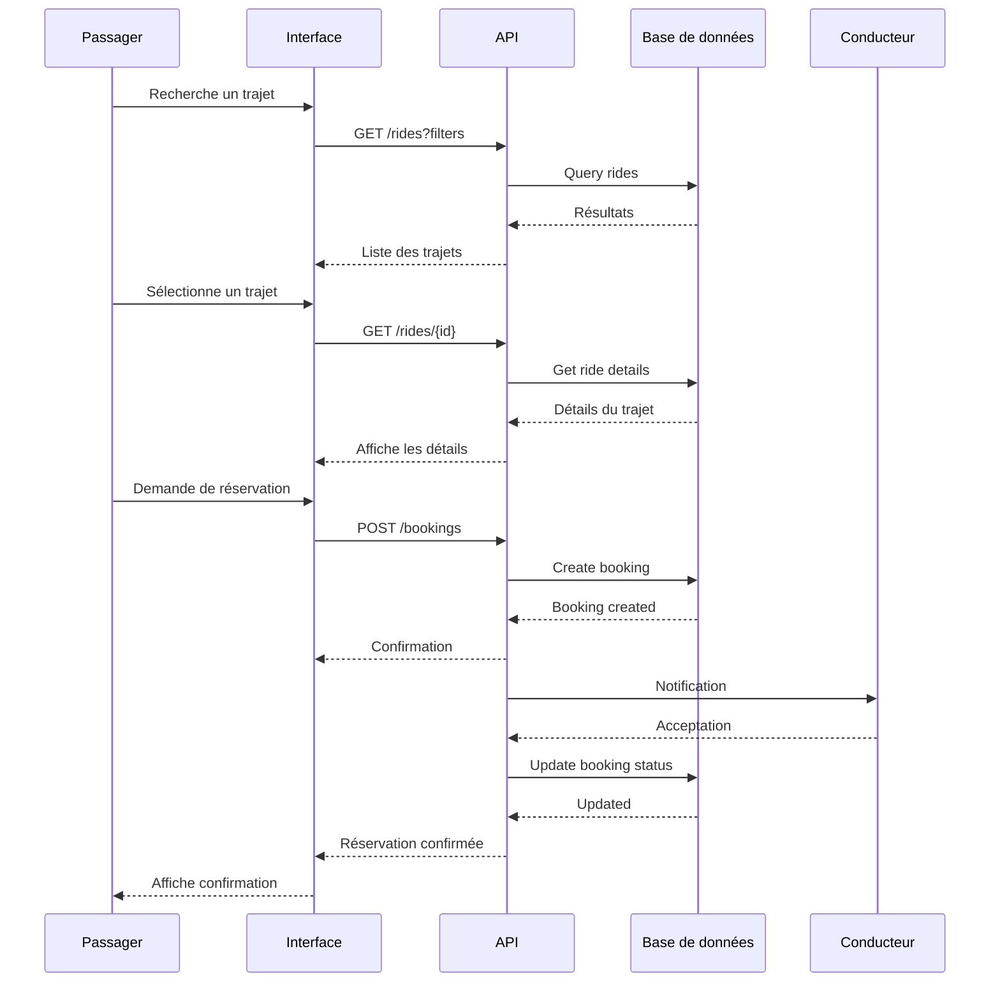

# Diagrammes UML ÉcoVoiturage 

## 1. Diagramme de Classes

## 2. Diagramme de Cas d'Utilisation

## 3. Diagramme de Séquence - Réservation d'un Trajet

## Notes sur les Diagrammes

### Diagramme de Classes
- Représente la structure statique du système
- Montre les relations entre les différentes entités
- Inclut les attributs et méthodes principales

### Diagramme de Cas d'Utilisation
- Illustre les interactions entre les acteurs et le système
- Montre les principales fonctionnalités
- Identifie les différents types d'utilisateurs

### Diagramme de Séquence
- Montre le flux d'une réservation de trajet
- Illustre les interactions entre les composants
- Inclut les validations et notifications

## Légende

### Relations dans le Diagramme de Classes
- `--|>` : Héritage
- `--` : Association
- `"1"` : Cardinalité un
- `"*"` : Cardinalité plusieurs

### Acteurs dans le Diagramme de Cas d'Utilisation
- Utilisateur : Utilisateur non authentifié
- Conducteur : Utilisateur pouvant proposer des trajets
- Passager : Utilisateur pouvant réserver des trajets
- Administrateur : Gestionnaire du système

### Composants dans le Diagramme de Séquence
- Interface : Frontend de l'application
- API : Backend de l'application
- Base de données : Stockage persistant
- Acteurs : Utilisateurs du système

---

Ces diagrammes servent de référence pour le développement et la maintenance de l'application ÉcoVoiturage.
