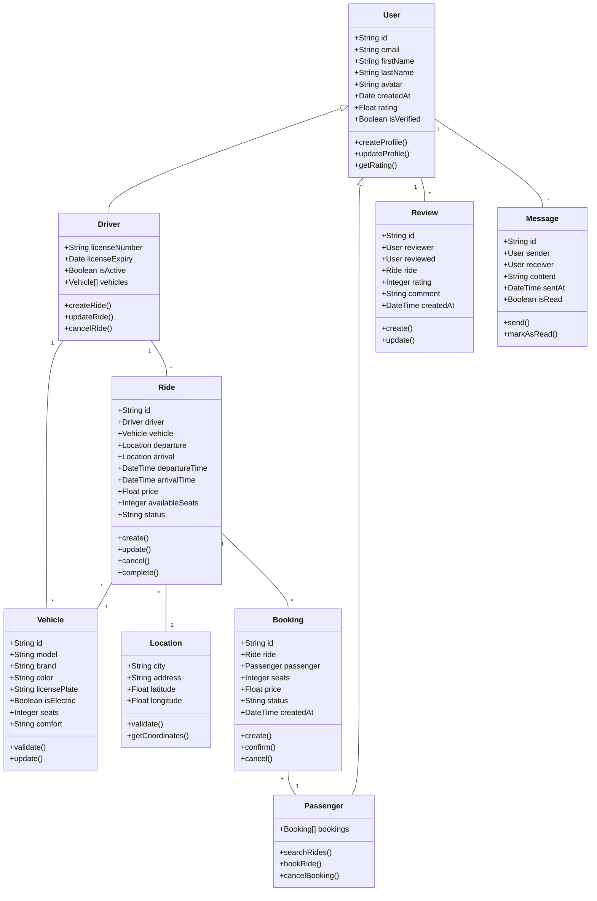
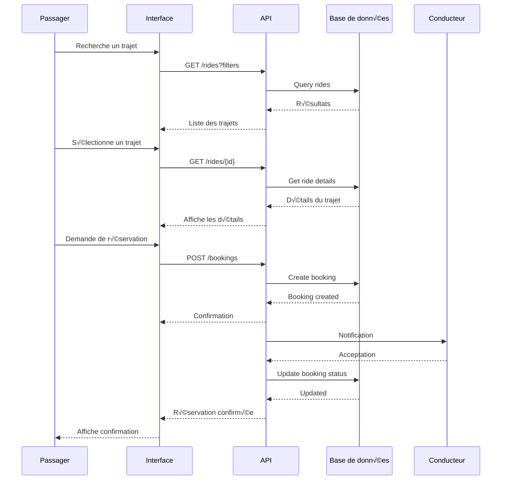

# Diagrammes UML ÉcoVoiturage 📊

## 1. Diagramme de Classes

```mermaid
classDiagram
    class User {
        +String id
        +String email
        +String firstName
        +String lastName
        +String avatar
        +Date createdAt
        +Float rating
        +Boolean isVerified
        +createProfile()
        +updateProfile()
        +getRating()
    }

    class Driver {
        +String licenseNumber
        +Date licenseExpiry
        +Boolean isActive
        +Vehicle[] vehicles
        +createRide()
        +updateRide()
        +cancelRide()
    }

    class Passenger {
        +Booking[] bookings
        +searchRides()
        +bookRide()
        +cancelBooking()
    }

    class Vehicle {
        +String id
        +String model
        +String brand
        +String color
        +String licensePlate
        +Boolean isElectric
        +Integer seats
        +String comfort
        +validate()
        +update()
    }

    class Ride {
        +String id
        +Driver driver
        +Vehicle vehicle
        +Location departure
        +Location arrival
        +DateTime departureTime
        +DateTime arrivalTime
        +Float price
        +Integer availableSeats
        +String status
        +create()
        +update()
        +cancel()
        +complete()
    }

    class Booking {
        +String id
        +Ride ride
        +Passenger passenger
        +Integer seats
        +Float price
        +String status
        +DateTime createdAt
        +create()
        +confirm()
        +cancel()
    }

    class Location {
        +String city
        +String address
        +Float latitude
        +Float longitude
        +validate()
        +getCoordinates()
    }

    class Review {
        +String id
        +User reviewer
        +User reviewed
        +Ride ride
        +Integer rating
        +String comment
        +DateTime createdAt
        +create()
        +update()
    }

    class Message {
        +String id
        +User sender
        +User receiver
        +String content
        +DateTime sentAt
        +Boolean isRead
        +send()
        +markAsRead()
    }

    User <|-- Driver
    User <|-- Passenger
    Driver "1" -- "*" Vehicle
    Driver "1" -- "*" Ride
    Ride "*" -- "1" Vehicle
    Ride "*" -- "2" Location
    Ride "1" -- "*" Booking
    Booking "*" -- "1" Passenger
    User "1" -- "*" Review
    User "1" -- "*" Message
```

## 2. Diagramme de Cas d'Utilisation

```mermaid
graph TB
    subgraph Système ÉcoVoiturage
        A[Rechercher un trajet]
        B[Réserver un trajet]
        C[Publier un trajet]
        D[Gérer son profil]
        E[Communiquer]
        F[Noter et commenter]
        G[Gérer les véhicules]
        H[Gérer les réservations]
    end

    User((Utilisateur)) --> D
    User --> A
    User --> E

    Driver((Conducteur)) --> C
    Driver --> G
    Driver --> H
    Driver --> F

    Passenger((Passager)) --> B
    Passenger --> F

    Admin((Administrateur)) --> I[Modérer les contenus]
    Admin --> J[Gérer les utilisateurs]
    Admin --> K[Suivre les statistiques]
```

## 3. Diagramme de Séquence - Réservation d'un Trajet

```mermaid
sequenceDiagram
    participant P as Passager
    participant UI as Interface
    participant API as API
    participant DB as Base de données
    participant D as Conducteur

    P->>UI: Recherche un trajet
    UI->>API: GET /rides?filters
    API->>DB: Query rides
    DB-->>API: Résultats
    API-->>UI: Liste des trajets

    P->>UI: Sélectionne un trajet
    UI->>API: GET /rides/{id}
    API->>DB: Get ride details
    DB-->>API: Détails du trajet
    API-->>UI: Affiche les détails

    P->>UI: Demande de réservation
    UI->>API: POST /bookings
    API->>DB: Create booking
    DB-->>API: Booking created
    API-->>UI: Confirmation
    API->>D: Notification
    D-->>API: Acceptation
    API->>DB: Update booking status
    DB-->>API: Updated
    API-->>UI: Réservation confirmée
    UI-->>P: Affiche confirmation
```

## Notes sur les Diagrammes

### Diagramme de Classes
- Représente la structure statique du système
- Montre les relations entre les différentes entités
- Inclut les attributs et méthodes principales

### Diagramme de Cas d'Utilisation
- Illustre les interactions entre les acteurs et le système
- Montre les principales fonctionnalités
- Identifie les différents types d'utilisateurs

### Diagramme de Séquence
- Montre le flux d'une réservation de trajet
- Illustre les interactions entre les composants
- Inclut les validations et notifications

## Légende

### Relations dans le Diagramme de Classes
- `--|>` : Héritage
- `--` : Association
- `"1"` : Cardinalité un
- `"*"` : Cardinalité plusieurs

### Acteurs dans le Diagramme de Cas d'Utilisation
- Utilisateur : Utilisateur non authentifié
- Conducteur : Utilisateur pouvant proposer des trajets
- Passager : Utilisateur pouvant réserver des trajets
- Administrateur : Gestionnaire du système

### Composants dans le Diagramme de Séquence
- Interface : Frontend de l'application
- API : Backend de l'application
- Base de données : Stockage persistant
- Acteurs : Utilisateurs du système

---

Ces diagrammes servent de référence pour le développement et la maintenance de l'application ÉcoVoiturage.